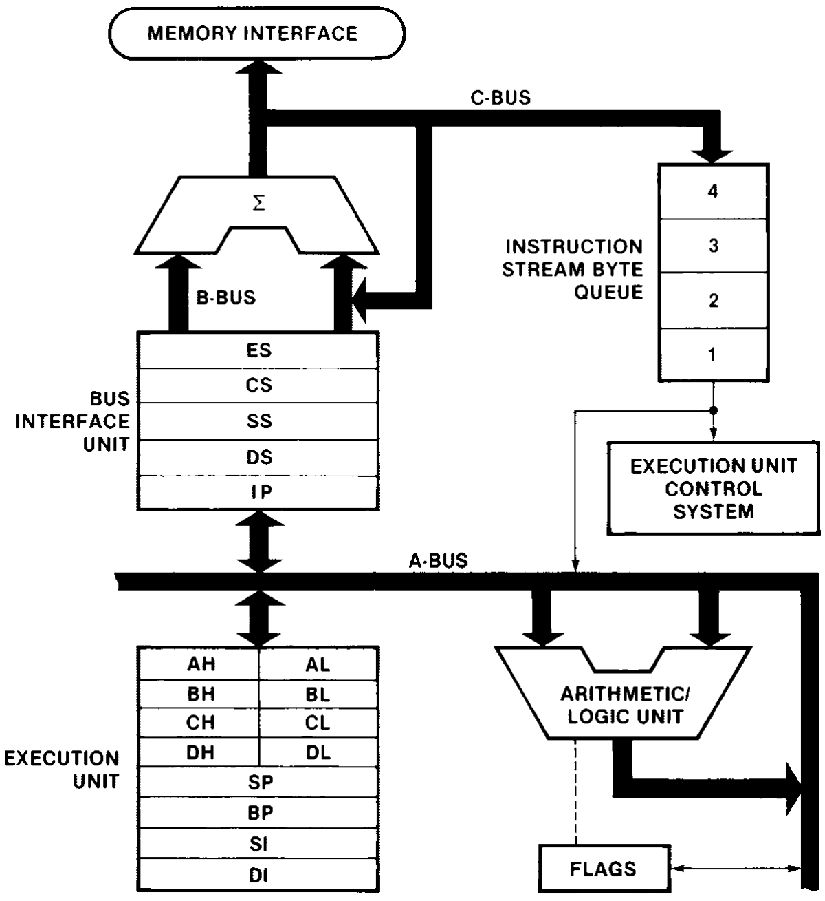
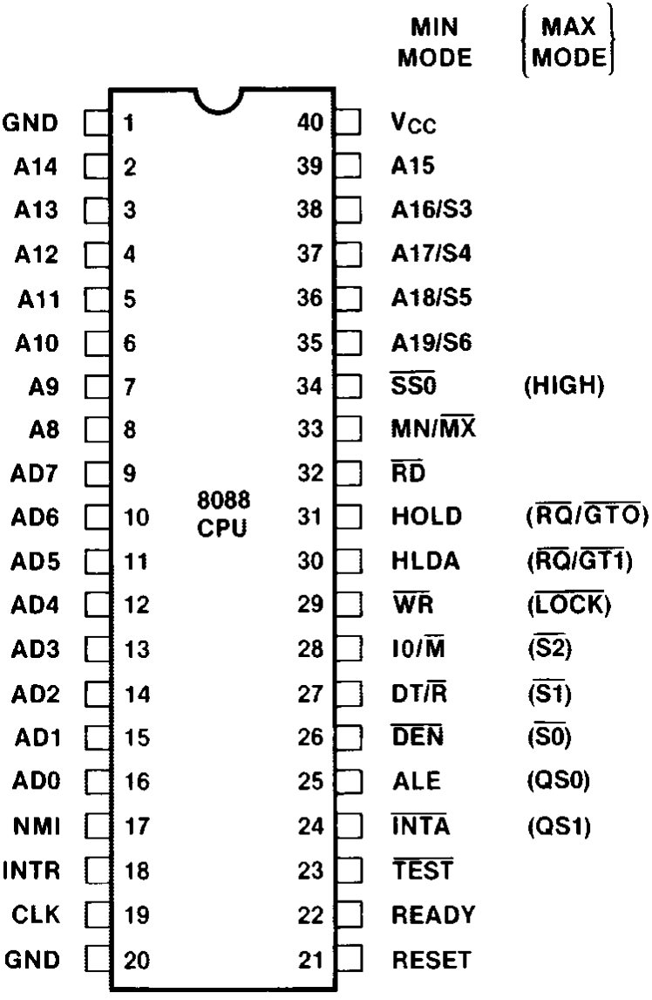
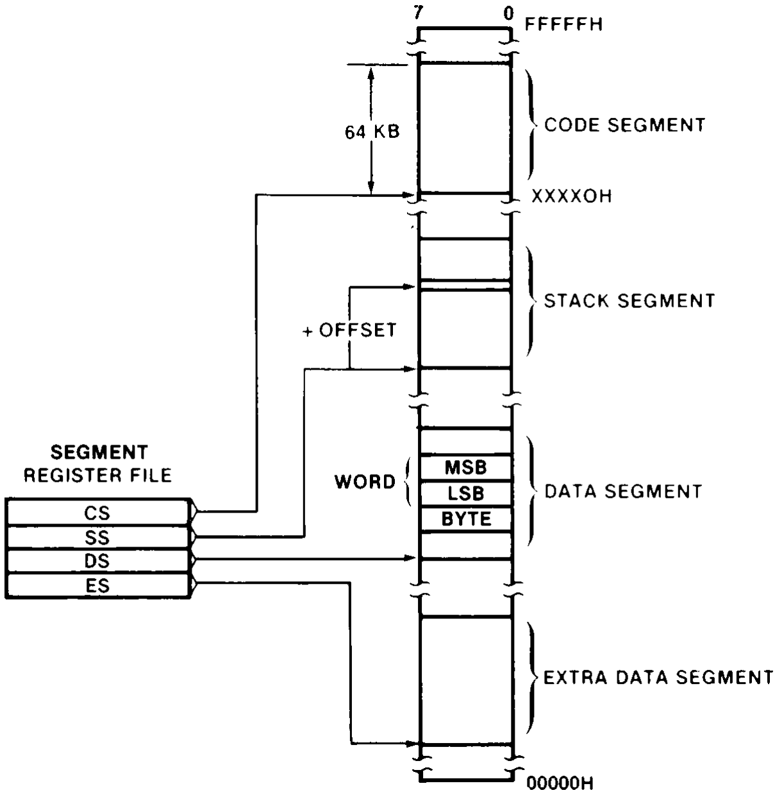
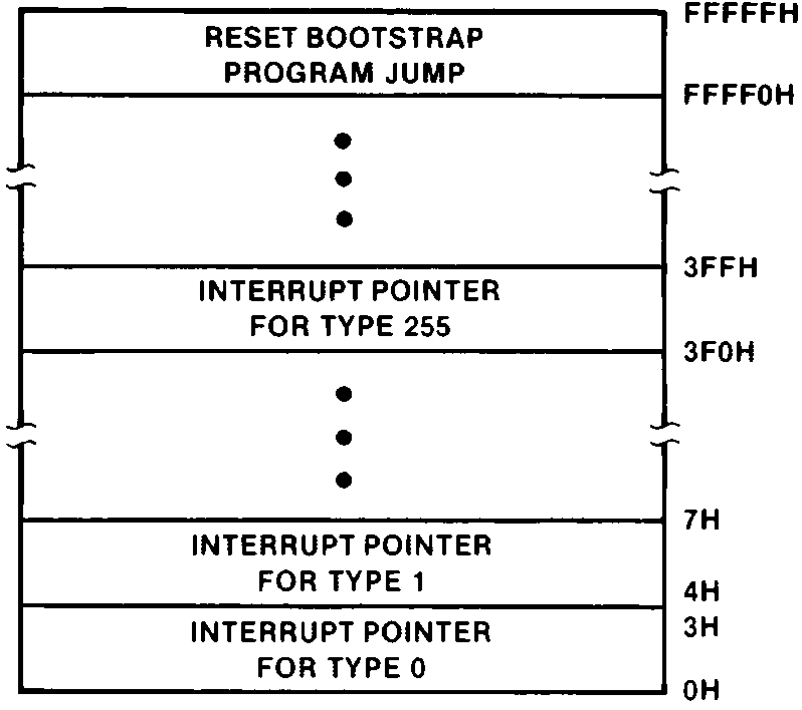
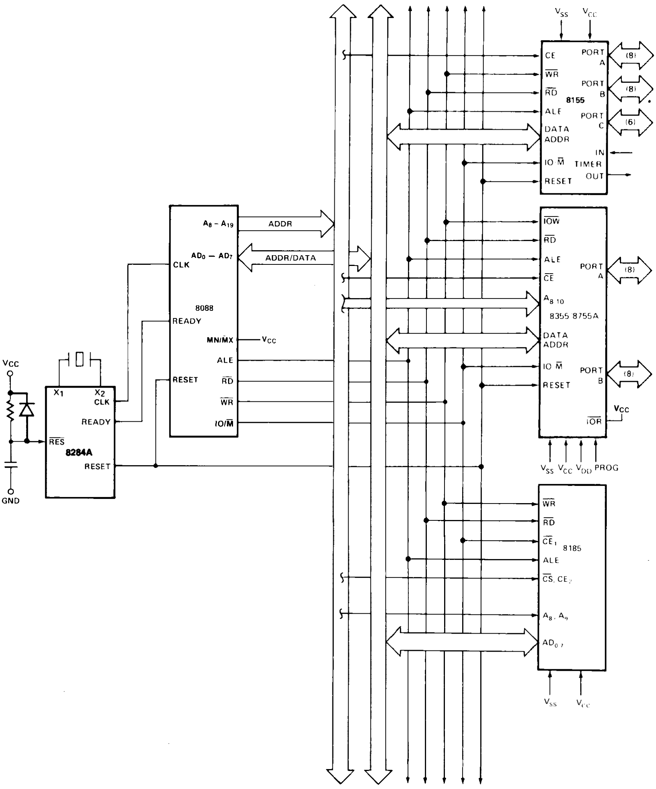
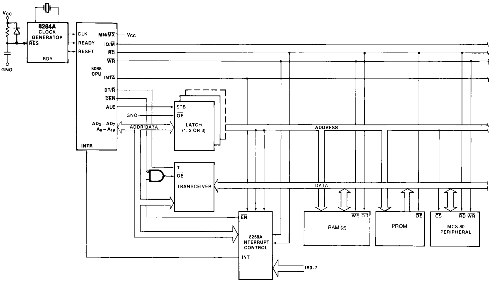
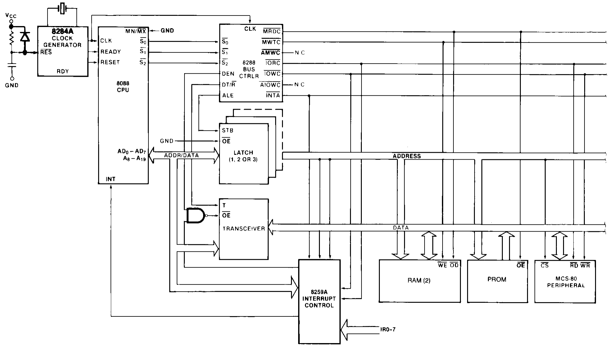
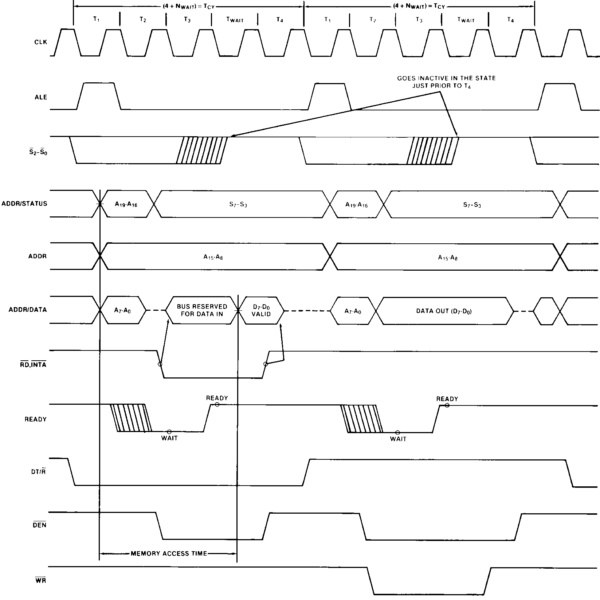
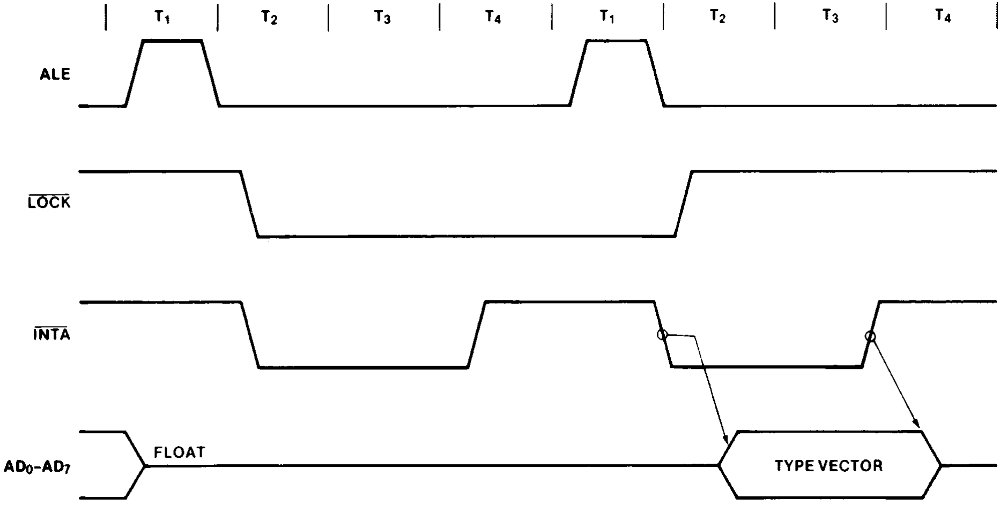
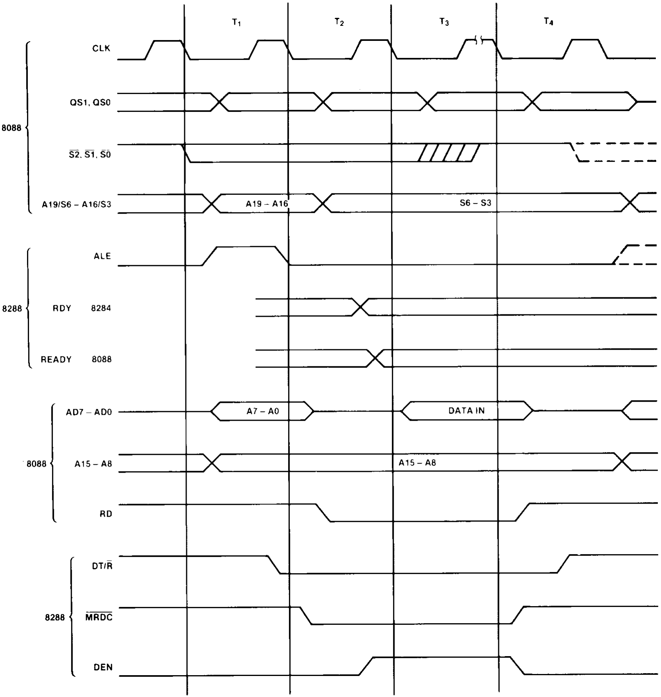

好的，这是您提供的PDF文件内容的中文翻译，已尽力保持原有的格式和排版。

***

**8088.pdf**
**1990年8月 订单号：231456-006**

**8088**
**8位 HMOS 微处理器**
**8088/8088-2**

**特性**
? 8位数据总线接口
? 16位内部架构
? 直接寻址能力达 1 Mbyte 内存
? 与 8086 CPU 直接软件兼容
? 14字 x 16位寄存器组，支持对称操作
? 24种操作数寻址模式
? 字节、字和块操作
? 8位和16位带符号及无符号二进制或十进制算术运算，包括乘法和除法
? 两种时钟频率：
�C 5 MHz 用于 8088
�C 8 MHz 用于 8088-2
? 可通过 EXPRESS 服务获取
�C 标准温度范围
�C 扩展温度范围

Intel 8088 是一款采用 N 沟道、耗尽型负载、硅栅技术（HMOS-II）实现的高性能微处理器，并封装在 40 引脚的 CERDIP 封装中。该处理器兼具 8 位和 16 位微处理器的特性。它直接兼容 8086 软件以及 8080/8085 硬件和外设。

**231456�C1**
**图 1. 8088 CPU 功能框图**

**231456�C2**
**图 2. 8088 引脚配置**

**表 1. 引脚说明**
以下引脚功能描述适用于最小模式或最大模式下的 8088 系统。这些描述中的“局部总线”是指直接连接到 8088 的多路复用总线接口（不考虑额外的总线缓冲器）。

| 符号       | 引脚号 | 类型 | 名称和功能                                                                                                                               |
| :--------- | :----- | :--- | :--------------------------------------------------------------------------------------------------------------------------------------- |
| AD7�CAD0    | 9�C16   | I/O  | **地址/数据总线**：这些线路构成了时分复用的存储器/IO 地址（T1）和数据（T2, T3, Tw, T4）总线。这些线路高电平有效，并在中断应答和局部总线“保持应答”期间浮空至第三态 OFF。 |
| A15�CA8     | 2�C8,39 | O    | **地址总线**：这些线路在整个总线周期（T1�CT4）内提供地址位 8 至 15。这些线路不需要通过 ALE 锁存即可保持有效。A15�CA8 高电平有效，并在中断应答和局部总线“保持应答”期间浮空至第三态 OFF。 |
| A17/S4, A16/S3 | 35�C38 | O    | **地址/状态**：在 T1 期间，这是用于存储器操作的四条最高有效地址线。在 I/O 操作期间，这些线路为低电平。在存储器和 I/O 操作期间，状态信息在 T2、T3、Tw 和 T4 期间在这些线路上可用。S6 始终为低电平。中断使能标志位（S5）的状态在每个时钟周期的开始更新。S4 和 S3 的编码如下所示。此信息指示当前正在使用哪个段寄存器进行数据访问。这些线路在局部总线“保持应答”期间浮空至第三态 OFF。 |
|            |        |      | S4 S3 特性   0 (低) 0 备用数据   0 1 堆栈   1 (高) 0 代码或无   1 1 数据   S6 为 0 (低)                                                                 |
| RD         | 32     | O    | **读选通**：读选通指示处理器正在执行存储器或 I/O 读周期，具体取决于 IO/M 引脚或 S2 的状态。此信号用于读取位于 8088 局部总线上的设备。RD 在任何读周期的 T2、T3 和 Tw 期间低电平有效，并保证在 T2 期间保持高电平，直到 8088 局部总线浮空。此信号在“保持应答”期间浮空至第三态 OFF。 |
| READY      | 22     | I    | **就绪**：来自被寻址的存储器或 I/O 设备的应答，表明它将完成数据传送。来自存储器或 I/O 的 RDY 信号由 8284 时钟发生器同步以形成 READY。此信号高电平有效。8088 的 READY 输入未同步。如果不满足建立和保持时间，则无法保证正确操作。 |
| INTR       | 18     | I    | **中断请求**：这是一个电平触发输入，在每个指令的最后一个时钟周期被采样，以确定处理器是否应进入中断应答操作。通过位于系统存储器中的中断向量查找表向量到一个子程序。它可以通过软件重置中断使能位在内部被屏蔽。INTR 在内部同步。此信号高电平有效。 |
| TEST       | 23     | I    | **测试**：该输入由“等待测试”指令检查。如果 TEST 输入为低电平，则继续执行，否则处理器在“空闲”状态等待。此输入在每个时钟周期的 CLK 上升沿在内部同步。 |

**2**

**8088**

**表 1. 引脚说明（续）**

| 符号 | 引脚号 | 类型 | 名称和功能                                                                                                                                                             |
| :--- | :----- | :--- | :--------------------------------------------------------------------------------------------------------------------------------------------------------------------- |
| NMI  | 17     | I    | **不可屏蔽中断**：这是一个边沿触发输入，会导致类型 2 中断。通过位于系统存储器中的中断向量查找表向量到一个子程序。NMI 不能在内部通过软件屏蔽。从低电平到高电平的转换在当前指令结束时启动中断。此输入在内部同步。 |
| RESET | 21    | I    | **复位**：导致处理器立即终止其当前活动。该信号必须保持高电平有效至少四个时钟周期。当 RESET 返回低电平时，按照指令集描述中的说明重新开始执行。RESET 在内部同步。                 |
| CLK  | 19     | I    | **时钟**：为处理器和总线控制器提供基本时序。它是非对称的，具有 33% 的占空比，以提供优化的内部时序。                                                                     |
| VCC  | 40     |      | **VCC**：是 +5V ±10% 电源引脚。                                                                                                                                        |
| GND  | 1, 20  |      | **地**：是接地引脚。                                                                                                                                                   |
| MN/MX | 33    | I    | **最小/最大模式**：指示处理器将在何种模式下运行。两种模式在后续章节中讨论。                                                                                             |

以下引脚功能描述适用于 8088 最小模式（即 MN/MX = VCC）。仅描述了最小模式下特有的引脚功能；所有其他引脚功能如上所述。

| 符号  | 引脚号 | 类型 | 名称和功能                                                                                                                                                             |
| :---- | :----- | :--- | :--------------------------------------------------------------------------------------------------------------------------------------------------------------------- |
| IO/M  | 28     | O    | **状态线**：是最大模式下 S2 的反相。它用于区分存储器访问和 I/O 访问。IO/M 在总线周期之前的 T4 变为有效，并保持有效直到周期的最后一个 T4（I/O=高，M=低）。IO/M 在局部总线“保持应答”期间浮空至第三态 OFF。 |
| WR    | 29     | O    | **写选通**：指示处理器正在执行写存储器或写 I/O 周期，具体取决于 IO/M 信号的状态。WR 在任何写周期的 T2、T3 和 Tw 期间有效。它低电平有效，并在局部总线“保持应答”期间浮空至第三态 OFF。 |
| INTA  | 24     | O    | **中断应答**：用作中断应答周期的读选通。它在每个中断应答周期的 T2、T3 和 Tw 期间低电平有效。                                                                           |
| ALE   | 25     | O    | **地址锁存使能**：由处理器提供，用于将地址锁存到地址锁存器中。它是一个高电平脉冲，在任何总线周期的 T1 的时钟低电平期间有效。注意 ALE 从不浮空。                               |
| DT/R  | 27     | O    | **数据发送/接收**：在希望使用数据总线收发器的最小系统中需要。它用于控制通过收发器的数据流方向。逻辑上，DT/R 等同于最大模式下的 S1，其时序与 IO/M 相同（T=高，R=低）。此信号在局部“保持应答”期间浮空至第三态 OFF。 |
| DEN   | 26     | O    | **数据使能**：在为使用收发器的最小系统中的数据总线收发器提供输出使能。DEN 在每次存储器和 I/O 访问以及 INTA 周期期间低电平有效。对于读或 INTA 周期，它从 T2 中间到 T4 中间有效；而对于写周期，它从 T2 开始到 T4 中间有效。DEN 在局部总线“保持应答”期间浮空至第三态 OFF。 |

**3**

**8088**

**表 1. 引脚说明（续）**

| 符号    | 引脚号 | 类型 | 名称和功能                                                                                                                                                             |
| :------ | :----- | :--- | :--------------------------------------------------------------------------------------------------------------------------------------------------------------------- |
| HOLD, HLDA | 31, 30 | I, O | **保持，保持应答**：HOLD 指示另一个主设备正在请求局部总线“保持”。要被确认，HOLD 必须为高电平有效。接收到“保持”请求的处理器将在 T4 或 Ti 时钟周期的中间发出 HLDA（高电平）作为应答。在发出 HLDA 的同时，处理器将使局部总线和控制线浮空。在检测到 HOLD 为低电平后，处理器将降低 HLDA，并且当处理器需要运行另一个周期时，它将再次驱动局部总线和控制线。HOLD 和 HLDA 具有内部上拉电阻。保持不是异步输入。如果系统无法保证建立时间，则应提供外部同步。 |
| SSO     | 34     | O    | **状态线**：在逻辑上等同于最大模式下的 S0。SSO、IO/M 和 DT/R 的组合允许系统完全解码当前总线周期状态。                                                                   |
|         |        |      | IO/M DT/R SSO 特性   1(高) 0 0 中断应答   1 0 1 读 I/O 端口   1 1 0 写 I/O 端口   1 1 1 暂停   0(低) 0 0 代码访问   0 0 1 读存储器   0 1 0 写存储器   0 1 1 无操作 |

以下引脚功能描述适用于最大模式下的 8088/8288 系统（即 MN/MX = GND）。仅描述了最大模式下特有的引脚功能；所有其他引脚功能如上所述。

| 符号 | 引脚号 | 类型 | 名称和功能                                                                                                                                                             |
| :--- | :----- | :--- | :--------------------------------------------------------------------------------------------------------------------------------------------------------------------- |
| S2,S1,S0 | 26�C28 | O    | **状态**：在 T4、T1 和 T2 的时钟高电平期间有效，并在 T3 或当 READY 为高电平时的 Tw 期间返回到无操作状态（1,1,1）。该状态由 8288 总线控制器用于生成所有存储器和 I/O 访问控制信号。S2、S1 或 S0 在 T4 期间的任何变化用于指示总线周期的开始，而在 T3 和 Tw 期间返回到无操作状态用于指示总线周期的结束。这些信号在“保持应答”期间浮空至第三态 OFF。在 RESET 变为有效后的第一个时钟周期，这些信号为高电平有效。在这第一个时钟之后，它们浮空至第三态 OFF。 |
|      |        |      | S2 S1 S0 特性   0(低) 0 0 中断应答   0 0 1 读 I/O 端口   0 1 0 写 I/O 端口   0 1 1 暂停   1(高) 0 0 代码访问   1 0 1 读存储器   1 1 0 写存储器   1 1 1 无操作 |

**4**

**8088**

**表 1. 引脚说明（续）**

| 符号    | 引脚号 | 类型 | 名称和功能                                                                                                                                                             |
| :------ | :----- | :--- | :--------------------------------------------------------------------------------------------------------------------------------------------------------------------- |
| RQ/GT0, RQ/GT1 | 30, 31 | I/O | **请求/授权**：引脚被其他局部总线主设备用于强制处理器在处理器当前总线周期结束时释放局部总线。每个引脚是双向的，RQ/GT0 的优先级高于 RQ/GT1。RQ/GT 具有内部上拉电阻，因此可以不连接。请求/授权序列如下（参见图 8）： 1. 来自另一个局部总线主设备的一个 CLK 宽度的脉冲表示向 8088 发出的局部总线请求（“保持”）（脉冲 1）。 2. 在 T4 或 TI 时钟周期期间，从 8088 向请求主设备发出的一个时钟宽度的脉冲（脉冲 2）表示 8088 已允许局部总线浮空，并且它将在下一个 CLK 进入“保持应答”状态。CPU 的总线接口单元在“保持应答”期间在逻辑上与局部总线断开连接。总线释放时适用于 HOLD/HOLDA 的相同规则也适用。 3. 来自请求主设备的一个 CLK 宽度的脉冲向 8088 指示（脉冲 3）“保持”请求即将结束，8088 可以在下一个 CLK 收回局部总线。然后 CPU 进入 T4。 每个主-主设备对局部总线的交换是一个三个脉冲的序列。每次总线交换后必须有一个空闲的 CLK 周期。脉冲低电平有效。 如果在 CPU 执行存储器周期时发出请求，它将在该周期的 T4 期间释放局部总线，当满足以下所有条件时： 1. 请求发生在 T2 或之前。 2. 当前周期不是字的低位字节。 3. 当前周期不是中断应答序列的第一个应答。 4. 当前没有正在执行锁定指令。 如果在请求时局部总线空闲，则将发生以下两种可能事件之一： 1. 局部总线将在下一个时钟释放。 2. 存储器周期将在 3 个时钟内开始。现在，适用于当前活动存储器周期的四个规则适用，条件 1 已满足。 |
| LOCK   | 29     | O    | **锁定**：指示当 LOCK 有效（低电平）时，其他系统总线主设备不得获得系统总线的控制权。LOCK 信号由“LOCK”前缀指令激活，并保持有效直到下一条指令完成。此信号低电平有效，并在“保持应答”期间浮空至第三态 OFF。 |
| QS1, QS0 | 24, 25 | O    | **队列状态**：提供状态以允许外部跟踪内部 8088 指令队列。队列状态在队列操作执行后的 CLK 周期内有效。                                                                   |
|        |        |      | QS1 QS0 特性   0(低) 0 无操作   0 1 从队列取操作码的第一个字节   1(高) 0 清空队列   1 1 从队列取后续字节                                                       |
| �C      | 34     | O    | 引脚 34 在最大模式下始终为高电平。                                                                                                                                     |

**5**

**231456�C3**
**图 3. 存储器组织**
   
**功能说明**

**存储器组织**
处理器向存储器提供 20 位地址，用于定位被引用的字节。存储器被组织为一个线性数组，最多可达 100 万字节，地址从 00000(H) 到 FFFFF(H)。存储器在逻辑上分为代码、数据、附加数据和堆栈段，每段最多 64K 字节，每个段落在 16 字节边界上（参见图 3）。

所有存储器引用都是相对于包含在高速段寄存器中的基地址进行的。段类型的选择基于程序的寻址需求。根据下表规则自动选择要使用的段寄存器。一个段类型中的所有信息共享相同的逻辑属性（例如代码或数据）。通过将存储器结构化为具有相似特性的可重定位区域，并自动选择段寄存器，程序更短、更快且更具结构性。

字（16 位）操作数可以位于偶数或奇数地址边界。对于地址和数据操作数，字的最低有效字节存储在较低值的地址位置，最高有效字节存储在下一个较高地址位置。BIU 将自动为 16 位操作数执行两次读取或写入周期。

| 存储器引用     | 段        | 使用的段寄存器                             |
| :------------- | :-------- | :----------------------------------------- |
| 指令           | CODE (CS) | 所有指令预取时自动使用。                   |
| 堆栈           | STACK (SS) | 所有堆栈压入和弹出。相对于 BP 基寄存器的存储器引用（数据引用除外）。 |
| 局部数据       | DATA (DS) | 数据引用时：相对于堆栈、字符串操作的目标或显式覆盖。 |
| 外部（全局）数据 | EXTRA (ES) | 字符串操作的目标：使用段覆盖显式选择。     |

**6**

**8088**

存储器中的某些位置保留用于特定的 CPU 操作（参见图 4）。地址 FFFF0H 到 FFFFFH 的位置保留用于操作，包括跳转到初始系统初始化例程。RESET 之后，CPU 将始终在 FFFF0H 位置开始执行，跳转指令必须位于此处。位置 00000H 到 003FFH 保留用于中断操作。由 16 位段地址和 16 位偏移地址组成的四字节指针将程序流引导到 256 个可能的中断服务例程之一。假定指针元素在中断发生之前已存储在保留存储器中各自的位置。

**最小和最大模式**
支持最小和最大 8088 系统的要求差异很大，无法通过 40 个唯一定义的引脚有效完成。因此，8088 配备了一个 strap 引脚（MN/MX），用于定义系统配置。

**231456�C4**

**图 4. 保留存储器位置**

一部分引脚的定义会根据 strap 引脚的状态而改变。当 MN/MX 引脚连接到 GND 时，8088 在最大模式下定义引脚 24 至 31 和 34。当 MN/MX 引脚连接到 VCC 时，8088 自己在引脚 24 至 31 和 34 上生成总线控制信号。

最小模式 8088 可以与多路复用或解复用总线一起使用。多路复用总线配置与 MCS-85 多路复用总线外设兼容。这种配置（参见图 5）为用户提供了最小芯片数量的系统。这种架构以高度集成的形式提供了 8088 的处理能力。

解复用模式需要一个锁存器（用于 64K 地址能力）或两个锁存器（用于完整的 1M 字节寻址）。如果地址总线负载需要，可以使用第三个锁存器进行缓冲。如果数据总线需要缓冲，也可以使用收发器（参见图 6）。8088 提供 DEN 和 DT/R 来控制收发器，并提供 ALE 来锁存地址。这种最小模式的配置提供了标准的总线结构，具有强大的总线缓冲和宽松的总线时序要求。

最大模式采用 8288 总线控制器（参见图 7）。8288 解码状态线 S0、S1 和 S2，并向系统提供所有总线控制信号。将总线控制移至 8288 为控制线提供了更好的源电流和灌电流能力，并释放了 8088 引脚用于扩展的大型系统特性。8088 在最大模式下提供硬件锁定、队列状态和两个请求/授权接口。这些特性允许在局部总线和远程总线配置中使用协处理器。

**7**

**8088**

**231456�C5**

**图 5. 多路复用总线配置**

**8**

**8088**

**231456�C6**

**图 6. 解复用总线配置**

**231456�C7**

**图 7. 使用总线控制器的完全缓冲系统**

**9**

**8088**

**总线操作**
8088 地址/数据总线分为三部分――低 8 位地址/数据位（AD0�CAD7）、中间 8 位地址位（A8�CA15）和高 4 位地址位（A16�CA19）。地址/数据位和最高 4 位地址位是时分复用的。这种技术最有效地利用了处理器上的引脚，允许使用标准的 40 引脚封装。中间 8 位地址位不复用，即它们在每个总线周期内保持有效。此外，如果系统需要标准的非多路复用总线，可以在处理器处使用单个地址锁存器对总线进行解复用。

每个处理器总线周期由至少四个 CLK 周期组成。这些周期称为 T1、T2、T3 和 T4（参见图 8）。地址在 T1 期间从处理器发出，数据传送在 T3 和 T4 期间在总线上发生。

**图 8.处理器总线周期**

T2 主要用于在读操作期间改变总线的方向。如果被寻址的设备给出“未就绪”指示，则在 T3 和 T4 之间插入“等待”状态（Tw）。每个插入的“等待”状态与一个 CLK 周期持续时间相同。在 8088 驱动的总线周期之间可能出现周期。这些周期称为“空闲”状态（Ti），或不活动的 CLK 周期。处理器使用这些周期进行内部管理。

在任何总线周期的 T1 期间，发出 ALE（地址锁存使能）信号（由处理器或 8288 总线控制器发出，具体取决于 MN/MX strap）。在该脉冲的下降沿，可以锁存有效的地址和该周期的某些状态信息。

状态位 S0、S1 和 S2 在最大模式下由总线控制器使用，根据下表识别总线事务的类型：

| S2  | S1  | S0  | 特性               |
| :-- | :-- | :-- | :----------------- |
| 0(低) | 0   | 0   | 中断应答         |
| 0   | 0   | 1   | 读 I/O          |
| 0   | 1   | 0   | 写 I/O          |
| 0   | 1   | 1   | 暂停         |
| 1(高) | 0   | 0   | 指令取指       |
| 1   | 0   | 1   | 从存储器读数据 |
| 1   | 1   | 0   | 向存储器写数据 |
| 1   | 1   | 1   | 无操作（无总线周期） |

状态位 S3 到 S6 与高位地址位复用，因此在 T2 到 T4 期间有效。S3 和 S4 指示在该总线周期中形成地址时使用了哪个段寄存器，根据下表：

| S4  | S3  | 特性                 |
| :-- | :-- | :------------------- |
| 0(低) | 0   | 备用数据（附加段） |
| 0   | 1   | 堆栈               |
| 1(高) | 0   | 代码或无         |
| 1   | 1   | 数据               |

S5 是 PSW 中断使能位的反映。S6 始终等于 0。

**I/O 寻址**
在 8088 中，I/O 操作最多可寻址 64K 个 I/O 寄存器。I/O 地址以与存储器地址相同的格式出现在总线 A15�CA0 上。地址线 A19�CA16 在 I/O 操作中为零。使用寄存器 DX 作为指针的可变 I/O 指令具有完整的地址能力，而直接 I/O 指令直接寻址 I/O 地址空间第 0 页中的 256 个 I/O 字节位置中的一或两个。I/O 端口的寻址方式与存储器位置相同。

熟悉 8085 或升级 8085 设计的设计人员应注意，8085 使用 8 位地址在 16 位地址总线的前后两半部分对 I/O 进行寻址。8088 在其低 16 位地址线上使用完整的 16 位地址。

**外部接口**

**处理器复位和初始化**
处理器初始化或启动通过激活（高电平）RESET 引脚来完成。8088 的 RESET 要求保持高电平超过四个时钟周期。8088 将在 RESET 的上升沿终止操作，并在 RESET 为高电平期间保持休眠状态。RESET 的下降沿触发内部复位序列，持续大约 7 个时钟周期。在此间隔之后，8088 开始正常操作，从绝对位置 FFFF0H 的指令开始（参见图 4）。RESET 输入在内部与处理器时钟同步。在初始化时，RESET 从高电平到低电平的转换必须在电源开启后不早于 50ms 发生，以允许 8088 完全初始化。

在 RESET 结束后的第二个时钟之前置位的 NMI 将不被响应。如果 NMI 在该时间点之后且在内部复位序列期间置位，处理器可能在响应中断之前执行一条指令。在 RESET 之后立即有效的保持请求将在第一次指令取指之前得到响应。

所有三态输出在 RESET 期间浮空至第三态 OFF。状态在 RESET 变为有效后的第一个时钟周期内处于有效状态，然后浮空至第三态 OFF。ALE 和 HLDA 被驱动为低电平。

**中断操作**
中断操作分为两类：软件启动或硬件启动。软件启动的中断和硬件中断的软件方面在 iAPX 88 手册或 iAPX 86,88 用户手册的指令集描述中指定。硬件中断可分为不可屏蔽或可屏蔽。

**11**

**8088**

中断导致控制权转移到新的程序位置。一个包含 256 个元素的中断服务程序位置地址指针表位于绝对位置 0 到 3FFH（参见图 4），这些位置为此目的而保留。表中的每个元素大小为 4 字节，对应一个中断“类型”。中断设备在中断应答序列期间提供一个 8 位类型号，该类型号用于通过相应的元素向量到新的中断服务程序位置。

**不可屏蔽中断 (NMI)**
处理器提供一个不可屏蔽中断 (NMI) 引脚，其优先级高于可屏蔽中断请求 (INTR) 引脚。一个典型的用途是激活电源故障例程。NMI 在低电平到高电平的转换时边沿触发。此引脚的激活会导致类型 2 中断。NMI 在高电平状态的持续时间要求大于两个时钟周期，但不需要与时钟同步。NMI 的任何上升沿都在片内锁存，并将在当前指令结束时或块类型指令的整个传送（在字移动的情况下为 2 个字节）之间得到服务。对 NMI 的最坏情况响应是乘法、除法和变量移位指令。对于下降沿的发生没有规定；它可能发生在 NMI 服务之前、期间或之后。如果在 NMI 过程开始之后发生另一个上升沿，则会触发另一个响应。该信号通常必须没有逻辑毛刺，并且下降沿必须没有抖动，以避免触发额外的响应。

**可屏蔽中断 (INTR)**
8088 提供一个中断请求输入 (INTR)，可以通过软件重置中断使能 (IF) 标志位在内部屏蔽该中断请求信号是电平触发的。它在每个时钟周期的 CLK 上升沿在内部同步。要得到响应，INTR 必须在当前指令结束或块类型指令的整个传送结束之前的时钟周期内存在（高电平）。在中断响应序列期间，进一步的中断被禁用。使能位作为对任何中断（INTR、NMI、软件中断或单步）的响应的一部分被重置，尽管自动压入堆栈的 FLAGS 寄存器反映了中断前处理器的状态。在旧的 FLAGS 寄存器被恢复之前，使能位将为零，除非由指令显式设置。

在响应序列期间（参见图 9），处理器执行两个连续（背靠背）的中断应答周期。8088 从第一个总线周期的 T2 到第二个总线周期的 T2 发出 LOCK 信号（仅最大模式）。在第二个总线周期结束之前，局部总线“保持”请求将不被响应。在第二个总线周期中，从外部中断系统（例如，8259A PIC）获取一个字节，该字节标识中断的源（类型）。该字节乘以四，并用作中断向量查找表中的指针。保持高电平的 INTR 信号将在使能位和采样周期的限制内被持续响应。中断返回指令包括一个标志弹出，它在恢复标志时返回原始中断使能位的状态。

**HALT**
当执行软件 HALT 指令时，处理器以两种方式之一指示它正在进入 HALT 状态，具体取决于 strap 的模式。在最小模式下，处理器发出 ALE（延迟一个时钟周期），以允许系统锁存暂停状态。暂停状态在 IO/M、DT/R 和 SSO 上可用。在最大模式下，处理器在 S2、S1 和 S0 上发出适当的 HALT 状态，8288 总线控制器发出一个 ALE。当在 HALT 期间进入局部总线保持时，8088 不会离开 HALT 状态。在这种情况下，处理器在局部总线保持结束时重新发出 HALT 指示符。中断请求或 RESET 将强制 8088 退出 HALT 状态。

**通过 LOCK 进行读/修改/写（信号量）操作**
当指令执行期间需要连续的总线周期时，处理器提供 LOCK 状态信息。这允许处理器对存储器执行读/修改/写操作（通过“与存储器交换寄存器”指令），而另一个系统总线主设备不会接收到中间存储器周期。这在多处理器系统配置中用于实现“测试并设置锁”操作非常有用。LOCK 信号在 LOCK 前缀指令解码后的时钟周期被激活（低电平）。它在 LOCK 前缀之后的指令的最后一个总线周期结束时被取消激活。当 LOCK 有效时，RQ/GT 引脚上的请求将被记录，并在 LOCK 结束时得到响应。

**12**

**8088**

**231456�C9**

**图 9. 中断应答序列**

**通过 TEST 进行外部同步**
作为中断的替代方案，8088 提供了一个单一的软件可测试输入引脚 (TEST)。通过执行 WAIT 指令来利用此输入。单一的 WAIT 指令会重复执行，直到 TEST 输入变为有效（低电平）。一旦队列满，WAIT 的执行不会消耗总线周期。

如果在 WAIT 执行期间发生局部总线请求，8088 将使所有输出驱动器进入第三态。如果中断被使能，8088 将识别中断并处理它们。然后 WAIT 指令被重新取指并重新执行。

**基本系统时序**
在最小模式下，MN/MX 引脚连接到 VCC，处理器发出与 8085 总线结构兼容的总线控制信号。在最大模式下，MN/MX 引脚连接到 GND，处理器发出编码的状态信息，8288 总线控制器使用该信息生成 MULTIBUS 兼容的总线控制信号。

**系统时序 �C 最小系统**
（参见图 8）
读周期在 T1 开始时断言地址锁存使能 (ALE) 信号。该信号的下降沿用于将此时在地址/数据总线 (AD0�CAD7) 上有效的地址信息锁存到 8282/8283 锁存器中。地址线 A8 到 A15 不需要锁存，因为它们在整个总线周期内保持有效。从 T1 到 T4，IO/M 信号指示存储器或 I/O 操作。在 T2，地址从地址/数据总线移除，总线进入高阻抗状态。读控制信号也在 T2 断言。读 (RD) 信号使被寻址的设备能够将其数据总线驱动器使能到局部总线。一段时间后，总线上将有有效数据，被寻址的设备将驱动 READY 线为高电平。当处理器将读信号返回到高电平时，被寻址的设备将再次使其总线驱动器进入第三态。如果需要收发器来缓冲 8088 局部总线，8088 提供信号 DT/R 和 DEN。

写周期也从断言 ALE 和发出地址开始。IO/M 信号再次断言以指示存储器或 I/O 写操作。在 T2，紧接地址发出之后，处理器发出要写入被寻址位置的数据。该数据保持有效直到至少 T4 的中间。在 T2、T3 和 Tw 期间，处理器断言写控制信号。写 (WR) 信号在 T2 开始时变为有效，与读信号不同，读信号延迟到 T2 中某个时间以提供总线浮空时间。

**13**

**8088**

中断应答周期与读周期的基本区别在于，中断应答 (INTA) 信号被断言以代替读 (RD) 信号，并且地址总线浮空。（参见图 9）在两个连续的 INTA 周期中的第二个周期中，从数据总线读取一个字节的信息，由中断系统逻辑（即 8259A 优先级中断控制器）提供。该字节标识中断的源（类型）。如前所述，它乘以四并用作中断向量查找表中的指针。

**总线时序 �C 中等复杂度系统**
（参见图 10）
对于中等复杂度系统，MN/MX 引脚连接到 GND，并且向系统添加了 8288 总线控制器、一个用于锁存系统地址的锁存器，以及一个允许总线负载超过 8088 处理能力的收发器。在这种配置中，信号 ALE、DEN 和 DT/R 由 8288 生成，而不是由处理器生成，尽管它们的时序保持相对相同。8088 状态输出（S2、S1 和 S0）提供周期类型信息并成为 8288 的输入。此总线周期信息指定读（代码、数据或 I/O）、写（数据或 I/O）、中断应答或软件暂停。因此，8288 发出指定存储器读或写、I/O 读或写或中断应答的控制信号。8288 提供两种类型的写选通，正常和提前，根据需要应用。正常写选通在写的上升沿数据有效。提前写选通与读选通具有相同的时序，因此，在写的上升沿数据无效。收发器从 8288 的 DT/R 和 DEN 输出接收通常的 T 和 OE 输入。

在第二个 INTA 周期期间传递的中断向量表指针可以来自位于局部总线或系统总线上的 8259A。如果主 8289A 优先级中断控制器位于局部总线上，则需要一个 TTL 门在中断应答序列和软件“轮询”期间从主 8259A 读取时禁用收发器。

**8088 与 8086 的比较**
8088 CPU 是一个围绕 8086 内部结构设计的 8 位处理器。8088 的大多数内部功能与等效的 8086 功能相同。8088 处理外部总线的方式与 8086 相同，区别在于一次只处理 8 位。16 位操作数的获取或写入需要两个连续的总线周期。对于软件工程师来说，这两个处理器看起来是相同的，除了执行时间。内部寄存器结构是相同的，所有指令具有相同的最终结果。8088 和 8086 之间的差异概述如下。不熟悉 8086 的工程师可以参考 iAPX 86, 88 用户手册的第 2 章和第 4 章，了解功能描述和指令集信息。在内部，8088 和 8086 之间存在三个差异。所有更改都与 8 位总线接口有关。

# 8088 中的队列长度为 4 字节，而 8086 队列包含 6 字节或三个字。缩短队列是为了防止 BIU 在预取指令时过度使用总线。这是必要的，因为一次取 8 位指令需要额外的时间。
# 为了进一步优化队列，预取算法被更改。每当队列中有 1 字节的空隙（可用空间）时，8088 BIU 将取一条新指令加载到队列中。8086 等待直到有 2 字节的空间可用。
# 指令集的内部执行时间受 8 位接口的影响。所有 16 位从存储器的取数和写入都需要额外的四个时钟周期。CPU 也受到指令取指速度的限制。后一个问题仅在一系列简单操作发生时出现。当使用 8088 的更复杂指令时，队列有时间填充，并且执行以执行单元允许的速度进行。

8088 和 8086 凭借其相同的执行单元完全软件兼容。依赖于系统的软件可能不能完全移植，但不依赖于系统的软件在 8088 和 8086 上同样运行良好。

8088 的硬件接口包含两个 CPU 之间的主要差异。然而，引脚分配几乎相同，但有以下功能更改：

# A8�CA15 �C 这些引脚在 8088 上仅是地址输出。这些地址线在内部锁存，并在整个总线周期内保持有效，类似于 8085 的高位地址线。
# BHE 在 8088 上没有意义，已被取消。
# SSO 在最小模式下提供 S0 状态信息。此输出仅在最小模式下出现在引脚 34 上。DT/R、IO/M 和 SSO 在最小模式下提供完整的总线状态。
# IO/M 已被反相以与 MCS-85 总线结构兼容。
# ALE 在进入 HALT 时在最小模式下延迟一个时钟周期，以允许状态与 ALE 一起锁存。

**14**

**8088**

**231456�C10**

**图 10. 中等复杂度系统时序**

**15**

**8088**

**绝对最大额定值***
偏置下的环境温度 0°C 至 70°C
外壳温度（塑料） 0°C 至 95°C
外壳温度（CERDIP） 0°C 至 75°C
存储温度 -65°C 至 +150°C
任何引脚对地电压 -1.0V 至 +7V
功耗 2.5 瓦

注意：这是生产数据手册。规格如有变更，恕不另行通知。
*警告：使器件承受超过“绝对最大额定值”的压力可能会导致永久性损坏。这些仅是压力额定值。不建议在“操作条件”之外操作，长时间暴露在“操作条件”之外可能会影响器件可靠性。

**直流特性**
(TA = 0°C 至 70°C, TCASE(塑料) = 0°C 至 95°C, TCASE(CERDIP) = 0°C 至 75°C,
TA = 0°C 至 55°C 且 TCASE = 0°C 至 75°C 仅适用于 P8088-2
只要 TCASE 不超过，即保证 TA)
(VCC = 5V ±10% 用于 8088, VCC = 5V ±5% 用于 8088-2 和扩展温度 EXPRESS)

| 符号 | 参数                 | 最小值 | 最大值 | 单位 | 测试条件                     |
| :--- | :------------------- | :----- | :----- | :--- | :--------------------------- |
| VIL  | 输入低电压           | -0.5   | +0.8   | V    | (注 1)                       |
| VIH  | 输入高电压           | 2.0    | VCC+0.5 | V    | (注 1, 2)                    |
| VOL  | 输出低电压           |        | 0.45   | V    | IOL = 2.0 mA                 |
| VOH  | 输出高电压           | 2.4    |        | V    | IOH = -400 μA                |
| ICC  | 电源电流：8088       |        | 340    | mA   | TA = 25°C                    |
|      | 8088-2               |        | 350    |      |                              |
|      | P8088                |        | 250    |      |                              |
| ILI  | 输入漏电流           | ±10    |        | μA   | 0V ≤ VIN ≤ VCC (注 3)        |
| ILO  | 输出和 I/O 漏电流    | ±10    |        | μA   | 0.45V ≤ VOUT ≤ VCC           |
| VCL  | 时钟输入低电压       | -0.5   | +0.6   | V    |                              |
| VCH  | 时钟输入高电压       | 3.9    | VCC+1.0 | V    |                              |
| CIN  | 输入缓冲器电容       |        | 15     | pF   | fc = 1 MHz (除 AD0�CAD7, RQ/GT 外的所有输入) |
| CIO  | I/O 缓冲器电容       |        | 15     | pF   | fc = 1 MHz (AD0�CAD7, RQ/GT)  |

注：
1. VIL 测试时 MN/MX 引脚 = 0V
   VIH 测试时 MN/MX 引脚 = 5V
   MN/MX 引脚是 strap 引脚
2. 不适用于 RQ/GT0 和 RQ/GT1 引脚（引脚 30 和 31）
3. HOLD 和 HLDA ILI 最小值 = -30 μA, 最大值 = 500 μA

**16**

**8088**

**交流特性**
(TA = 0°C 至 70°C, TCASE(塑料) = 0°C 至 95°C, TCASE(CERDIP) = 0°C 至 75°C,
TA = 0°C 至 55°C 且 TCASE = 0°C 至 80°C 仅适用于 P8088-2
只要 TCASE 不超过，即保证 TA)
(VCC = 5V ±10% 用于 8088, VCC = 5V ±5% 用于 8088-2 和扩展温度 EXPRESS)

**最小复杂度系统时序要求**

| 符号    | 参数                         | 8088      |        | 8088-2    |        | 单位 | 测试条件                 |
| :------ | :--------------------------- | :-------- | :----- | :-------- | :----- | :--- | :----------------------- |
|         |                              | 最小值    | 最大值 | 最小值    | 最大值 |      |                          |
| TCLCL   | CLK 周期时间                 | 200       | 500    | 125       | 500    | ns   |                          |
| TCLCH   | CLK 低电平时间               | 118       |        | 68        |        | ns   |                          |
| TCHCL   | CLK 高电平时间               | 69        |        | 44        |        | ns   |                          |
| TCH1CH2 | CLK 上升时间                 |           | 10     |           | 10     | ns   | 从 1.0V 到 3.5V          |
| TCL2CL1 | CLK 下降时间                 |           | 10     |           | 10     | ns   | 从 3.5V 到 1.0V          |
| TDVCL   | 数据建立时间                 | 30        |        | 20        |        | ns   |                          |
| TCLDX   | 数据保持时间                 | 10        |        | 10        |        | ns   |                          |
| TR1VCL  | RDY 建立时间到 8284          | 35        |        | 35        |        | ns   | (注 1, 2)                |
| TCLR1X  | RDY 保持时间到 8284          | 0         |        | 0         |        | ns   | (注 1, 2)                |
| TRYHCH  | READY 建立时间到 8088        | 118       |        | 68        |        | ns   |                          |
| TCHRYX  | READY 保持时间到 8088        | 30        |        | 20        |        | ns   |                          |
| TRYLCL  | READY 无效到 CLK             | -8        |        | -8        |        | ns   | (注 3)                   |
| THVCH   | HOLD 建立时间                | 35        |        | 20        |        | ns   |                          |
| TINVCH  | INTR, NMI, TEST 建立时间     | 30        |        | 15        |        | ns   | (注 2)                   |
| TILIH   | 输入上升时间（除 CLK 外）    |           | 20     |           | 20     | ns   | 从 0.8V 到 2.0V          |
| TIHIL   | 输入下降时间（除 CLK 外）    |           | 12     |           | 12     | ns   | 从 2.0V 到 0.8V          |

**17**

**8088**

**交流特性（续）**
**时序响应**

| 符号    | 参数                         | 8088      |        | 8088-2    |        | 单位 | 测试条件                 |
| :------ | :--------------------------- | :-------- | :----- | :-------- | :----- | :--- | :----------------------- |
|         |                              | 最小值    | 最大值 | 最小值    | 最大值 |      |                          |
| TCLAV   | 地址有效延迟                 | 10        | 110    | 10        | 60     | ns   |                          |
| TCLAX   | 地址保持时间                 | 10        |        | 10        |        | ns   |                          |
| TCLAZ   | 地址浮空延迟                 | TCLAX     | 80     | TCLAX     | 50     | ns   |                          |
| TLHLL   | ALE 宽度                     | TCLCH-20  |        | TCLCH-10  |        | ns   |                          |
| TCLLH   | ALE 有效延迟                 |           | 80     |           | 50     | ns   |                          |
| TCHLL   | ALE 无效延迟                 |           | 85     |           | 55     | ns   |                          |
| TLLAX   | ALE 无效到地址保持时间       | TCHCL-10  |        | TCHCL-10  |        | ns   |                          |
| TCLDV   | 数据有效延迟                 | 10        | 110    | 10        | 60     | ns   |                          |
| TCHDX   | 数据保持时间                 | 10        |        | 10        |        | ns   |                          |
| TWHDX   | WR 之后的数据保持时间        | TCLCH-30  |        | TCLCH-30  |        | ns   |                          |
| TCVCTV  | 控制有效延迟 1               |           | 110    |           | 70     | ns   |                          |
| TCHCTV  | 控制有效延迟 2               |           | 110    |           | 60     | ns   |                          |
| TCVCTX  | 控制无效延迟                 | 10        | 110    | 10        | 70     | ns   |                          |
| TAZRL   | 地址浮空到 READ 有效         | 0         |        | 0         |        | ns   |                          |
| TCLRL   | RD 有效延迟                  | 10        | 165    | 10        | 100    | ns   |                          |
| TCLRH   | RD 无效延迟                  | 10        | 150    | 10        | 80     | ns   |                          |
| TRHAV   | RD 无效到下一个地址有效      | TCLCL-45  |        | TCLCL-40  |        | ns   |                          |
| TCLHAV  | HLDA 有效延迟                | 10        | 160    | 10        | 100    | ns   |                          |
| TRLRH   | RD 宽度                      | 2TCLCL-75 |        | 2TCLCL-50 |        | ns   |                          |
| TWLWH   | WR 宽度                      | 2TCLCL-60 |        | 2TCLCL-40 |        | ns   |                          |
| TAVAL   | 地址有效到 ALE 低电平        | TCLCH-60  |        | TCLCH-40  |        | ns   |                          |
| TOLOH   | 输出上升时间                 |           | 20     |           | 20     | ns   | 从 0.8V 到 2.0V          |
| TOHOL   | 输出下降时间                 |           | 12     |           | 12     | ns   | 从 2.0V 到 0.8V          |

注：
1. 8284A 处的信号仅供参考。请参阅 8284A 数据手册以获取最新规格。
2. 仅适用于异步信号，以保证在下一个 CLK 被识别。
3. 仅适用于 T2 状态（进入 T3 状态 8 ns）。

**18**

**8088**

**交流测试输入、输出波形**
**231456�C11**
交流测试；输入在逻辑“1”时驱动至 2.4V，逻辑“0”时驱动至 0.45V。时序测量在逻辑“1”和逻辑“0”时均在 1.5V 进行。

**交流测试负载电路**
**231456�C12**
CL 包括测试夹具电容

**波形**
**总线时序 �C 最小模式系统**
**231456�C13**

**19**

**8088**

**波形（续）**
**总线时序 �C 最小模式系统（续）**
**231456�C14**

注：
1. 除非另有说明，所有信号在 VOH 和 VOL 之间切换。
2. 在 T2、T3、Tw 接近结束时对 RDY 进行采样，以确定是否要插入 Tw 机器状态。
3. 两个 INTA 周期背靠背运行。8088 局部 ADDR/DATA 总线在两个 INTA 周期期间都浮空。控制信号显示为第二个 INTA 周期。
4. 8284 处的信号仅供参考。
5. 除非另有说明，所有时序测量均在 1.5V 进行。

**20**

**8088**

**交流特性**
**最大模式系统（使用 8288 总线控制器）**
**时序要求**

| 符号    | 参数                         | 8088      |        | 8088-2    |        | 单位 | 测试条件                 |
| :------ | :--------------------------- | :-------- | :----- | :-------- | :----- | :--- | :----------------------- |
|         |                              | 最小值    | 最大值 | 最小值    | 最大值 |      |                          |
| TCLCL   | CLK 周期时间                 | 200       | 500    | 125       | 500    | ns   |                          |
| TCLCH   | CLK 低电平时间               | 118       |        | 68        |        | ns   |                          |
| TCHCL   | CLK 高电平时间               | 69        |        | 44        |        | ns   |                          |
| TCH1CH2 | CLK 上升时间                 |           | 10     |           | 10     | ns   | 从 1.0V 到 3.5V          |
| TCL2CL1 | CLK 下降时间                 |           | 10     |           | 10     | ns   | 从 3.5V 到 1.0V          |
| TDVCL   | 数据建立时间                 | 30        |        | 20        |        | ns   |                          |
| TCLDX   | 数据保持时间                 | 10        |        | 10        |        | ns   |                          |
| TR1VCL  | RDY 建立时间到 8284          | 35        |        | 35        |        | ns   | (注 1, 2)                |
| TCLR1X  | RDY 保持时间到 8284          | 0         |        | 0         |        | ns   | (注 1, 2)                |
| TRYHCH  | READY 建立时间到 8088        | 118       |        | 68        |        | ns   |                          |
| TCHRYX  | READY 保持时间到 8088        | 30        |        | 20        |        | ns   |                          |
| TRYLCL  | READY 无效到 CLK             | -8        |        | -8        |        | ns   | (注 4)                   |
| TINVCH  | 识别建立时间 (INTR, NMI, TEST) | 30        |        | 15        |        | ns   | (注 2)                   |
| TGVCH   | RQ/GT 建立时间               | 30        |        | 15        |        | ns   |                          |
| TCHGX   | RQ 保持时间到 8088           | 40        |        | 30        |        | ns   |                          |
| TILIH   | 输入上升时间（除 CLK 外）    |           | 20     |           | 20     | ns   | 从 0.8V 到 2.0V          |
| TIHIL   | 输入下降时间（除 CLK 外）    |           | 12     |           | 12     | ns   | 从 2.0V 到 0.8V          |

**21**

**8088**

**交流特性（续）**
**时序响应**

| 符号    | 参数                         | 8088      |        | 8088-2    |        | 单位 | 测试条件                 |
| :------ | :--------------------------- | :-------- | :----- | :-------- | :----- | :--- | :----------------------- |
|         |                              | 最小值    | 最大值 | 最小值    | 最大值 |      |                          |
| TCLML   | 命令有效延迟                 |           | 1035   |           | 1035   | ns   | (注 1)                   |
| TCLMH   | 命令无效延迟                 |           | 1035   |           | 1035   | ns   | (注 1)                   |
| TRYHSH  | READY 有效到状态无效         |           | 110    |           | 65     | ns   | (注 3)                   |
| TCHSV   | 状态有效延迟                 | 10        | 110    | 10        | 60     | ns   |                          |
| TCLSH   | 状态无效延迟                 | 10        | 130    | 10        | 70     | ns   |                          |
| TCLAV   | 地址有效延迟                 | 10        | 110    | 10        | 60     | ns   |                          |
| TCLAX   | 地址保持时间                 | 10        |        | 10        |        | ns   |                          |
| TCLAZ   | 地址浮空延迟                 | TCLAX     | 80     | TCLAX     | 50     | ns   |                          |
| TSVLH   | 状态有效到 ALE 高电平        |           | 15     |           | 15     | ns   | (注 1)                   |
| TSVMCH  | 状态有效到 MCE 高电平        |           | 15     |           | 15     | ns   | (注 1)                   |
| TCLLH   | CLK 低电平到 ALE 有效        |           | 15     |           | 15     | ns   | (注 1)                   |
| TCLMCH  | CLK 低电平到 MCE (注 1)      |           | 15     |           | 15     | ns   |                          |
| TCHLL   | ALE 无效延迟 (注 1)          |           | 15     |           | 15     | ns   |                          |
| TCLMCL  | MCE 无效延迟 (注 1)          |           | 15     |           | 15     | ns   |                          |
| TCLDV   | 数据有效延迟                 | 10        | 110    | 10        | 60     | ns   |                          |
| TCHDX   | 数据保持时间                 | 10        |        | 10        |        | ns   |                          |
| TCVNV   | 控制有效延迟                 |           | 545    |           | 545    | ns   | CL=20�C100 pF 适用于所有 8088 输出，外加内部负载 (注 1) |
| TCVNX   | 控制无效延迟                 |           | 1045   |           | 1045   | ns   | (注 1)                   |
| TAZRL   | 地址浮空到读有效             | 0         |        | 0         |        | ns   |                          |
| TCLRL   | RD 有效延迟                  | 10        | 165    | 10        | 100    | ns   |                          |
| TCLRH   | RD 无效延迟                  | 10        | 150    | 10        | 80     | ns   |                          |
| TRHAV   | RD 无效到下一个地址有效      | TCLCL-45  |        | TCLCL-40  |        | ns   |                          |
| TCHDTL  | 方向控制有效延迟 (注 1)      |           | 50     |           | 50     | ns   |                          |
| TCHDTH  | 方向控制无效延迟 (注 1)      |           | 30     |           | 30     | ns   |                          |
| TCLGL   | GT 有效延迟                  |           | 85     |           | 50     | ns   |                          |
| TCLGH   | GT 无效延迟                  |           | 85     |           | 50     | ns   |                          |
| TRLRH   | RD 宽度                      | 2TCLCL-75 |        | 2TCLCL-50 |        | ns   |                          |
| TOLOH   | 输出上升时间                 |           | 20     |           | 20     | ns   | 从 0.8V 到 2.0V          |
| TOHOL   | 输出下降时间                 |           | 12     |           | 12     | ns   | 从 2.0V 到 0.8V          |

注：
1. 8284 或 8288 处的信号仅供参考。
2. 仅适用于异步信号，以保证在下一个 CLK 被识别。
3. 仅适用于 T3 和等待状态。
4. 仅适用于 T2 状态（进入 T3 状态 8 ns）。

**22**

**8088**

**交流测试输入、输出波形**
**231456�C11**
交流测试；输入在逻辑“1”时驱动至 2.4V，逻辑“0”时驱动至 0.45V。时序测量在逻辑“1”和逻辑“0”时均在 1.5V 进行。

**交流测试负载电路**
**231456�C12**
CL 包括测试夹具电容

**波形（续）**
**总线时序 �C 最大模式系统**
**231456�C15**

**23**

**8088**

**波形（续）**
**总线时序 �C 最大模式系统（使用 8288）**
**231456�C16**

注：
1. 除非另有说明，所有信号在 VOH 和 VOL 之间切换。
2. 在 T2、T3、Tw 接近结束时对 RDY 进行采样，以确定是否要插入 Tw 机器状态。
3. 级联地址在第一个和第二个 INTA 周期之间有效。
4. 两个 INTA 周期背靠背运行。8088 局部 ADDR/DATA 总线在两个 INTA 周期期间都浮空。指针地址的控制显示为第二个 INTA 周期。
5. 8284 或 8288 处的信号仅供参考。
6. 8288 命令和控制信号（MRDC、MWTC、AMWC、IORC、IOWC、AIOWC、INTA 和 DEN）的发出滞后于高电平有效的 8288 CEN。
7. 除非另有说明，所有时序测量均在 1.5V 进行。
8. 状态在紧接 T4 之前的状态中无效。

**24**

**8088**

**波形（续）**
**异步信号识别**
**231456�C17**
注：
1. 仅适用于异步信号的建立要求，以保证在下一个 CLK 被识别。

**总线锁定信号时序（仅最大模式）**
**231456�C18**

**请求/授权序列时序（仅最大模式）**
**231456�C19**
注：
1. 协处理器不得在所示区域之外驱动总线，否则可能引发争用。

**保持/保持应答时序（仅最小模式）**
**231456�C20**

**25**

**8088**

**8086/8088 指令集摘要**

| 助记符和指令代码 | 说明                     |
| :--------------- | :----------------------- |
| **数据传送**     |                          |
| MOV = 传送：     |                          |
| 寄存器/存储器 到/从 寄存器 | 100010dw mod reg r/m     |
| 立即数 到 寄存器/存储器 | 1100011w mod 000 r/m data data if w=1 |
| 立即数 到 寄存器         | 1011w reg data data if w=1 |
| 存储器 到 累加器         | 1010000w addr-low addr-high |
| 累加器 到 存储器         | 1010001w addr-low addr-high |
| 寄存器/存储器 到 段寄存器 | 10001110 mod 0 reg r/m   |
| 段寄存器 到 寄存器/存储器 | 10001100 mod 0 reg r/m   |
| PUSH = 压入：    |                          |
| 寄存器/存储器            | 11111111 mod 110 r/m     |
| 寄存器                  | 01010 reg                |
| 段寄存器                | 000 reg 110              |
| POP = 弹出：     |                          |
| 寄存器/存储器            | 10001111 mod 000 r/m     |
| 寄存器                  | 01011 reg                |
| 段寄存器                | 000 reg 111              |
| XCHG = 交换：    |                          |
| 寄存器/存储器 与 寄存器  | 1000011w mod reg r/m     |
| 寄存器 与 累加器        | 10010 reg                |
| IN = 从...输入： |                          |
| 固定端口                | 1110010w port            |
| 可变端口                | 1110110w                 |
| OUT = 输出到...： |                          |
| 固定端口                | 1110011w port            |
| 可变端口                | 1110111w                 |
| XLAT = 转换字节到 AL | 11010111                 |
| LEA = 加载有效地址到寄存器 | 10001101 mod reg r/m     |
| LDS = 加载指针到 DS | 11000101 mod reg r/m     |
| LES = 加载指针到 ES | 11000100 mod reg r/m     |
| LAHF = 加载 AH 与标志 | 10011111                 |
| SAHF = 存储 AH 到标志 | 10011110                 |
| PUSHF = 压入标志 | 10011100                 |
| POPF = 弹出标志  | 10011101                 |

**26**

**8088**

**8086/8088 指令集摘要（续）**

| 助记符和指令代码 | 说明                     |
| :--------------- | :----------------------- |
| **算术**         |                          |
| ADD = 加：       |                          |
| 寄存器/存储器 与 寄存器 到 任一 | 000000dw mod reg r/m     |
| 立即数 到 寄存器/存储器 | 100000sw mod 000 r/m data data if s:w=01 |
| 立即数 到 累加器         | 0000010w data data if w=1 |
| ADC = 带进位加： |                          |
| 寄存器/存储器 与 寄存器 到 任一 | 000100dw mod reg r/m     |
| 立即数 到 寄存器/存储器 | 100000sw mod 010 r/m data data if s:w=01 |
| 立即数 到 累加器         | 0001010w data data if w=1 |
| INC = 递增：     |                          |
| 寄存器/存储器            | 1111111w mod 000 r/m     |
| 寄存器                  | 01000 reg                |
| AAA = ASCII 调整加法 | 00110111                 |
| DAA = 十进制调整加法 | 00100111                 |
| SUB = 减：       |                          |
| 寄存器/存储器 与 寄存器 到 任一 | 001010dw mod reg r/m     |
| 立即数 从 寄存器/存储器 | 100000sw mod 101 r/m data data if s:w=01 |
| 立即数 从 累加器         | 0010110w data data if w=1 |
| SBB = 带借位减： |                          |
| 寄存器/存储器 与 寄存器 到 任一 | 000110dw mod reg r/m     |
| 立即数 从 寄存器/存储器 | 100000sw mod 011 r/m data data if s:w=01 |
| 立即数 从 累加器         | 0001110w data data if w=1 |
| DEC = 递减：     |                          |
| 寄存器/存储器            | 1111111w mod 001 r/m     |
| 寄存器                  | 01001 reg                |
| NEG = 取负       | 1111011w mod 011 r/m     |
| CMP = 比较：     |                          |
| 寄存器/存储器 与 寄存器  | 001110dw mod reg r/m     |
| 立即数 与 寄存器/存储器 | 100000sw mod 111 r/m data data if s:w=01 |
| 立即数 与 累加器         | 0011110w data data if w=1 |
| AAS = ASCII 调整减法 | 00111111                 |
| DAS = 十进制调整减法 | 00101111                 |
| MUL = 乘（无符号） | 1111011w mod 100 r/m     |
| IMUL = 整数乘（有符号） | 1111011w mod 101 r/m     |
| AAM = ASCII 调整乘法 | 11010100 00001010        |
| DIV = 除（无符号） | 1111011w mod 110 r/m     |
| IDIV = 整数除（有符号） | 1111011w mod 111 r/m     |
| AAD = ASCII 调整除法 | 11010101 00001010        |
| CBW = 转换字节到字 | 10011000                 |
| CWD = 转换字到双字 | 10011001                 |

**27**

**8088**

**8086/8088 指令集摘要（续）**

| 助记符和指令代码 | 说明                     |
| :--------------- | :----------------------- |
| **逻辑**         |                          |
| NOT = 取反       | 1111011w mod 010 r/m     |
| SHL/SAL = 逻辑/算术左移 | 110100vw mod 100 r/m     |
| SHR = 逻辑右移   | 110100vw mod 101 r/m     |
| SAR = 算术右移   | 110100vw mod 111 r/m     |
| ROL = 循环左移   | 110100vw mod 000 r/m     |
| ROR = 循环右移   | 110100vw mod 001 r/m     |
| RCL = 带进位循环左移 | 110100vw mod 010 r/m     |
| RCR = 带进位循环右移 | 110100vw mod 011 r/m     |
| AND = 与：       |                          |
| 寄存器/存储器 与 寄存器 到 任一 | 001000dw mod reg r/m     |
| 立即数 到 寄存器/存储器 | 1000000w mod 100 r/m data data if w=1 |
| 立即数 到 累加器         | 0010010w data data if w=1 |
| TEST = 测试功能到标志，无结果： |                          |
| 寄存器/存储器 与 寄存器  | 1000010w mod reg r/m     |
| 立即数 与 寄存器/存储器 | 1111011w mod 000 r/m data data if w=1 |
| 立即数 与 累加器         | 1010100w data data if w=1 |
| OR = 或：        |                          |
| 寄存器/存储器 与 寄存器 到 任一 | 000010dw mod reg r/m     |
| 立即数 到 寄存器/存储器 | 1000000w mod 001 r/m data data if w=1 |
| 立即数 到 累加器         | 0000110w data data if w=1 |
| XOR = 异或：     |                          |
| 寄存器/存储器 与 寄存器 到 任一 | 001100dw mod reg r/m     |
| 立即数 到 寄存器/存储器 | 1000000w mod 110 r/m data data if w=1 |
| 立即数 到 累加器         | 0011010w data data if w=1 |
| **字符串操作**   |                          |
| REP = 重复       | 1111001z                 |
| MOVS = 传送字节/字 | 1010010w                 |
| CMPS = 比较字节/字 | 1010011w                 |
| SCAS = 扫描字节/字 | 1010111w                 |
| LODS = 加载字节/字到 AL/AX | 1010110w                 |
| STOS = 存储字节/字从 AL/AX | 1010101w                 |
| **控制转移**     |                          |
| CALL = 调用：    |                          |
| 段内直接                 | 11101000 disp-low disp-high |
| 段内间接                 | 11111111 mod 010 r/m     |
| 段间直接                 | 10011010 offset-low offset-high seg-low seg-high |
| 段间间接                 | 11111111 mod 011 r/m     |

**28**

**8088**

**8086/8088 指令集摘要（续）**

| 助记符和指令代码 | 说明                     |
| :--------------- | :----------------------- |
| JMP = 无条件跳转： |                          |
| 段内直接                 | 11101001 disp-low disp-high |
| 段内直接-短              | 11101011 disp            |
| 段内间接                 | 11111111 mod 100 r/m     |
| 段间直接                 | 11101010 offset-low offset-high seg-low seg-high |
| 段间间接                 | 11111111 mod 101 r/m     |
| RET = 从 CALL 返回： |                          |
| 段内                     | 11000011                 |
| 段内 立即数加到 SP       | 11000010 data-low data-high |
| 段间                     | 11001011                 |
| 段间 立即数加到 SP       | 11001010 data-low data-high |
| JE/JZ = 等于/为零跳转   | 01110100 disp            |
| JL/JNGE = 小于/不大于或等于跳转 | 01111100 disp            |
| JLE/JNG = 小于或等于/不大于跳转 | 01111110 disp            |
| JB/JNAE = 低于/不高于或等于跳转 | 01110010 disp            |
| JBE/JNA = 低于或等于/不高于跳转 | 01110110 disp            |
| JP/JPE = 奇偶/奇偶偶跳转 | 01111010 disp            |
| JO = 溢出跳转           | 01110000 disp            |
| JS = 符号跳转           | 01111000 disp            |
| JNE/JNZ = 不等于/不为零跳转 | 01110101 disp            |
| JNL/JGE = 不小于/大于或等于跳转 | 01111101 disp            |
| JNLE/JG = 不小于或等于/大于跳转 | 01111111 disp            |
| JNB/JAE = 不低于/高于或等于跳转 | 01110011 disp            |
| JNBE/JA = 不低于或等于/高于跳转 | 01110111 disp            |
| JNP/JPO = 无奇偶/奇偶奇跳转 | 01111011 disp            |
| JNO = 无溢出跳转        | 01110001 disp            |
| JNS = 无符号跳转        | 01111001 disp            |
| LOOP = 循环 CX 次       | 11100010 disp            |
| LOOPZ/LOOPE = 为零/相等时循环 | 11100001 disp            |
| LOOPNZ/LOOPNE = 不为零/不相等时循环 | 11100000 disp            |
| JCXZ = CX 为零跳转      | 11100011 disp            |
| INT = 中断              |                          |
| 指定类型                 | 11001101 type            |
| 类型 3                  | 11001100                 |
| INTO = 溢出中断         | 11001110                 |
| IRET = 中断返回         | 11001111                 |

**29**

**8088**

**8086/8088 指令集摘要（续）**

| 助记符和指令代码 | 说明                     |
| :--------------- | :----------------------- |
| **处理器控制**   |                          |
| CLC = 清除进位   | 11111000                 |
| CMC = 进位取反   | 11110101                 |
| STC = 设置进位   | 11111001                 |
| CLD = 清除方向   | 11111100                 |
| STD = 设置方向   | 11111101                 |
| CLI = 清除中断   | 11111010                 |
| STI = 设置中断   | 11111011                 |
| HLT = 暂停       | 11110100                 |
| WAIT = 等待      | 10011011                 |
| ESC = 换码（到外部设备） | 11011xxx mod xxx r/m     |
| LOCK = 总线锁定前缀 | 11110000                 |

**注：**
AL = 8 位累加器
AX = 16 位累加器
CX = 计数寄存器
DS = 数据段
ES = 附加段
高于/低于 指无符号值
大于 = 更正（更大）：
小于 = 更负（更小）有符号值
如果 d=1 则“到”寄存器；如果 d=0 则“从”寄存器
如果 w=1 则为字指令；如果 w=0 则为字节指令
如果 mod=11 则 r/m 被视为 REG 字段
如果 mod=00 则 DISP=0*，disp-low 和 disp-high 不存在
如果 mod=01 则 DISP=disp-low 符号扩展为 16 位，disp-high 不存在
如果 mod=10 则 DISP=disp-high；disp-low
如果 r/m=000 则 EA=(BX)+(SI)+DISP
如果 r/m=001 则 EA=(BX)+(DI)+DISP
如果 r/m=010 则 EA=(BP)+(SI)+DISP
如果 r/m=011 则 EA=(BP)+(DI)+DISP
如果 r/m=100 则 EA=(SI)+DISP
如果 r/m=101 则 EA=(DI)+DISP
如果 r/m=110 则 EA=(BP)+DISP*
如果 r/m=111 则 EA=(BX)+DISP
DISP 跟随指令的第二字节（在数据之前，如果需要）
* 除了如果 mod=00 且 r/m=110 则 EA=disp-high：disp-low。
如果 s:w=01 则 16 位立即数形成操作数
如果 s:w=11 则一个立即数字节被符号扩展以形成 16 位操作数
如果 v=0 则“计数”=1；如果 v=1 则“计数”在 (CL) 寄存器中
x = 无关
z 用于字符串原语，用于与 ZF 标志比较

**段超越前缀**
001 reg 110
REG 根据下表分配：
16位 (w=1) 8位 (w=0) 段
000 AX 000 AL 00 ES
001 CX 001 CL 01 CS
010 DX 010 DL 10 SS
011 BX 011 BL 11 DS
100 SP 100 AH
101 BP 101 CH
110 SI 110 DH
111 DI 111 BH
引用标志寄存器文件作为 16 位对象的指令使用符号 FLAGS 表示该文件：
FLAGS = X:X:X:X:(OF):(DF):(IF):(TF):(SF):(ZF):X:(AF):X:(PF):X:(CF)
助记符 ? Intel, 1978

**数据手册修订回顾**
以下列表代表了本数据手册与 -005 版本之间的主要区别。请仔细阅读此摘要。
1. Intel 8088 的实现技术（HMOS）已更改为（HMOS-II）。

**30**